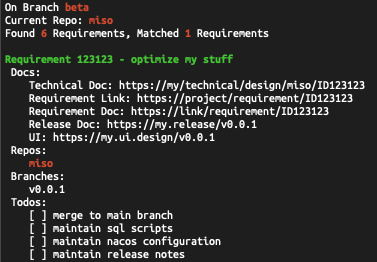

# requirement

Simple tool to manage requirements.

### The Requirement Template

~~~md
- [ ] Requirement ID972612 optimize speed
  - Doc:
    - Technical Doc: https://my/technical/design/miso/ID972612
    - Requirement Link: https://project/requirement/ID972612
    - Requirement Doc: https://link/requirement/ID972612
    - Release Doc: https://miso.release/v0.0.1
    - UI: https://miso.ui.design/v0.0.1
    - Other:
  - Repo:
    - miso
  - Branch:
    - v0.0.1
  - Todo:
    - [x] merge to main branch
    - [x] maintain sql scripts
    - [ ] maintain nacos configuration
    - [ ] maintain release notes

```
# scripts for the requirement above

curl -X POST ....
INSERT INTO .....
```
~~~

### Configure Requirment File Location

Export environment variable to specify where the requirement file is:

```sh
export REQUIREMENTS_FILE=/my/requirement/file.txt
```

### Use requirement.go

Go to your project's working directory (git project directory), and runs requirement.go.

```bash
~/dev/git/miso (dev)$ go run ~/requirement/requirement.go
```

Then requirement.go will start parsing your requirement file. It then identifies the name of the current repository and the branch that it's on, and finally it will display all the requirements that are possibly related to current repository (by matching branch name or repository name).



### Filter Previous Requirements

As requirement.go parses the requirement file, when it finds the line that matches `'## Active Requirements'`, it will ignore all the requirements come before this line.

In the example below, Requirement ID1 and ID2 are ignored.

```md
- [ ] Requirement ID1
- [ ] Requirement ID2

## Active Requirements

- [ ] Requirement ID3
- [ ] Requirement ID4
```
